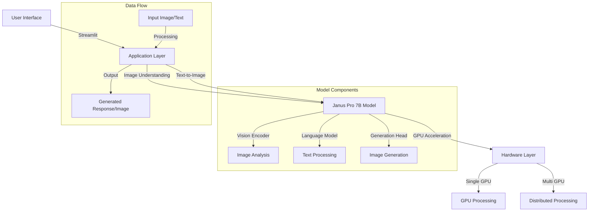

# Deepseek Janus Pro 7B Demo

A Streamlit-based demo application showcasing the capabilities of the Deepseek Janus Pro 7B model for multimodal understanding and image generation.

## Technical Architecture


## Features

- **Image Understanding**: Upload images and ask questions about them
- **Text-to-Image Generation**: Generate images from text descriptions
- **Interactive UI**: User-friendly interface with adjustable parameters
- **GPU/CPU Support**: Automatic device detection and optimization

## Requirements

- Python 3.8+
- PyTorch
- CUDA (optional, for GPU acceleration)
- Minimum 8GB GPU VRAM (16GB+ recommended for optimal performance)

## Installation

### Method 1: Direct Installation

1. Clone the repository:
```bash
git clone https://github.com/vinoth12940/Deepseek_JanusPro7B.git
cd Deepseek_JanusPro7B
```

2. Install and update pip:
```bash
python3 -m ensurepip --upgrade
python3 -m pip install --upgrade pip
```

3. Install the required packages:
```bash
pip install -r requirements.txt
```

### Method 2: Lightning AI Studio Installation

1. Visit [Lightning AI Studio](https://lightning.ai/cmnuse27/vision-model/studios/deepseek-januspro7b/code)

2. Clone the Lightning AI workspace:
```bash
lightning clone lightning.ai/cmnuse27/vision-model/studios/deepseek-januspro7b
```

3. Install Lightning AI CLI:
```bash
pip install lightning
```

4. Set up Lightning AI environment:
```bash
lightning run app app.py --cloud
```

## Running the Application

### Local Deployment

1. **Streamlit Interface**
```bash
streamlit run app.py
```
Access at: `http://localhost:8501`

2. **Gradio Interface** (Alternative)
```bash
python3 demo/app_januspro.py
```
Access at: `http://127.0.0.1:7860`

### Lightning AI Cloud Deployment

1. **Initialize Lightning Project**
```bash
lightning init deepseek-janus-app
cd deepseek-janus-app
```

2. **Configure Lightning App** (create `lightning_app.py`):
```python
import lightning as L
from lightning.app import LightningApp, LightningFlow
from lightning.app.frontend import StreamlitFrontend

class JanusFlow(LightningFlow):
    def __init__(self):
        super().__init__()
        self.ready = False

    def run(self):
        self.ready = True

    def configure_layout(self):
        return StreamlitFrontend(render_fn=render_fn)

app = LightningApp(JanusFlow())
```

3. **Deploy to Lightning AI Cloud**
```bash
lightning run app lightning_app.py --cloud
```

## Environment Setup

### Local Environment
```bash
# Create and activate conda environment
conda create -n janus-env python=3.8
conda activate janus-env

# Install PyTorch with CUDA support
conda install pytorch torchvision torchaudio pytorch-cuda=11.8 -c pytorch -c nvidia

# Install Janus dependencies
pip install git+https://github.com/deepseek-ai/Janus.git
pip install -e .[gradio]  # For Gradio interface
```

### Lightning AI Cloud Environment
```yaml
# requirements.txt for Lightning AI
lightning
torch>=2.0.0
torchvision
transformers
diffusers
gradio
streamlit
numpy
Pillow
accelerate
git+https://github.com/deepseek-ai/Janus.git
```

## Hardware Requirements

### Recommended Setup (Based on Lightning AI)
- **GPU**: 1x RTX A6000 or better
- **RAM**: 64GB (48GB minimum)
- **CPU**: 64 Cores (48 minimum)
- **Storage**: 100GB free space

### Minimum Requirements
- **GPU**: NVIDIA GPU with 8GB+ VRAM
- **RAM**: 16GB
- **CPU**: 8 Cores
- **Storage**: 20GB free space

## GPU Configuration

### Single GPU Setup
```python
# Run on a single GPU
import torch
from lightning.fabric.accelerators import find_usable_cuda_devices

# Automatically select available GPU
devices = find_usable_cuda_devices(1)
os.environ["CUDA_VISIBLE_DEVICES"] = str(devices[0])
```

### Multi-GPU Setup
```python
# For multiple GPUs, modify the app.py configuration:
devices = find_usable_cuda_devices(num_gpus)  # num_gpus is the number of GPUs you want to use

# Example for 2 GPUs
trainer = Trainer(accelerator="gpu", devices=2)

# Use all available GPUs
trainer = Trainer(accelerator="gpu", devices=-1)

# Specify particular GPU indices
trainer = Trainer(accelerator="gpu", devices=[0, 1])  # Use GPU 0 and 1
```

### GPU Memory Optimization
```python
# Add these environment variables for better memory management
os.environ['PYTORCH_MPS_HIGH_WATERMARK_RATIO'] = '0.0'
os.environ['PYTORCH_MPS_LOW_WATERMARK_RATIO'] = '0.0'

# For multi-GPU setups, add:
torch.cuda.empty_cache()  # Clear GPU memory before running
```

## Usage

Run the Streamlit application:
```bash
streamlit run app.py
```

The application will be available at `http://localhost:8501` in your web browser.

### Image Understanding
1. Navigate to the "Image Understanding" tab
2. Upload an image
3. Enter your question about the image
4. Adjust parameters in the sidebar if needed:
   - Seed: For reproducibility
   - Top P: Controls diversity of responses
   - Temperature: Controls randomness of responses
5. Click "Analyze" to get the model's response

### Image Generation
1. Navigate to the "Image Generation" tab
2. Enter your text prompt
3. Adjust parameters in the sidebar if needed:
   - Generation Seed: For reproducibility
   - CFG Weight: Controls how closely the generation follows the prompt
4. Click "Generate" to create images

## Model Details

This demo uses the Deepseek Janus Pro 7B model, which is a multimodal model capable of:
- Understanding and analyzing images
- Generating images from text descriptions
- Engaging in visual question-answering tasks

## Parameters

### Image Understanding
- **Seed**: Controls randomness (default: 42)
- **Top P**: Nucleus sampling parameter (default: 0.95)
- **Temperature**: Controls response randomness (default: 0.1)

### Image Generation
- **Generation Seed**: Controls generation randomness (default: 12345)
- **CFG Weight**: Controls prompt adherence (default: 5.0)

## System Requirements

- **CPU**: Modern multi-core processor
- **RAM**: Minimum 16GB recommended
- **GPU**: NVIDIA GPU with 8GB+ VRAM (optional, for faster processing)
   - Single GPU: Minimum 8GB VRAM
   - Multi-GPU: Combined VRAM should exceed 16GB
   - Recommended: NVIDIA A100, V100, or RTX 3090/4090 for optimal performance
- **Storage**: At least 20GB free space

## Performance Optimization

### GPU Memory Tips
1. Batch size adjustment based on available VRAM
2. Gradient checkpointing for memory efficiency
3. Mixed precision training (FP16/BF16)
4. Regular cache clearing
5. Proper model offloading when not in use

### Multi-GPU Best Practices
1. Even distribution of model across GPUs
2. Proper synchronization of model parameters
3. Efficient data loading and preprocessing
4. Regular monitoring of GPU utilization
5. Proper error handling for GPU failures

## Limitations

- GPU memory usage can be high during image generation
- Processing times may vary based on hardware
- Image generation quality depends on prompt clarity
- Multi-GPU setup requires careful memory management
- Some features may be limited on lower-end GPUs

## License

This project uses the Deepseek Janus Pro 7B model. Please refer to the model's license for usage terms.

## Acknowledgments

- Deepseek AI for the Janus Pro 7B model
- Streamlit for the web interface framework
- PyTorch community
- Lightning AI for GPU acceleration support

## Support

For issues and questions, please open an issue in the GitHub repository.

## Monitoring and Debugging

### GPU Monitoring
```bash
# Monitor GPU usage
nvidia-smi -l 1

# Memory monitoring
nvidia-smi --query-gpu=memory.used,memory.free,memory.total --format=csv -l 1
```

### Common Issues and Solutions
1. **Out of Memory (OOM)**
   - Reduce batch size
   - Enable gradient checkpointing
   - Use mixed precision training
   
2. **GPU Synchronization**
   - Check CUDA version compatibility
   - Ensure proper device mapping
   - Monitor GPU temperature and usage

3. **Performance Issues**
   - Check GPU utilization
   - Monitor memory bandwidth
   - Optimize data loading pipeline 

## Lightning AI Integration

### Custom Components

1. **Create Lightning Components**
```python
from lightning.app import LightningWork

class JanusComponent(LightningWork):
    def __init__(self):
        super().__init__()
        self.model = None
        self.processor = None

    def run(self):
        # Model initialization code
        pass
```

2. **Define Flow Control**
```python
class JanusFlow(LightningFlow):
    def __init__(self):
        super().__init__()
        self.janus = JanusComponent()

    def run(self):
        self.janus.run()
```

### Deployment Options

1. **Local Development**
```bash
lightning run app local
```

2. **Cloud Deployment**
```bash
lightning run app cloud
```

3. **Production Deployment**
```bash
lightning deploy ./app --cloud
```

### Monitoring in Lightning AI

1. Access the Lightning AI Studio dashboard
2. Monitor:
   - GPU utilization
   - Memory usage
   - Model performance
   - API endpoints

### Lightning AI Specific Features

1. **Automatic Scaling**
   - Dynamic resource allocation
   - Multi-GPU support
   - Auto-scaling based on load

2. **Experiment Tracking**
   - Model metrics
   - Training logs
   - Performance analytics

3. **Collaboration Tools**
   - Share workspace
   - Team access control
   - Version control integration 